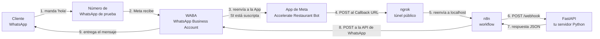
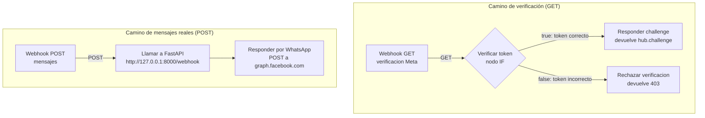
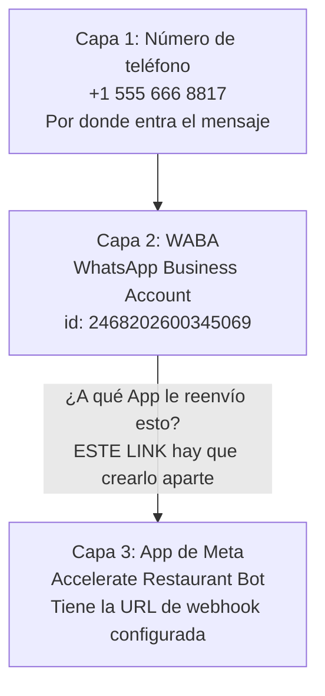
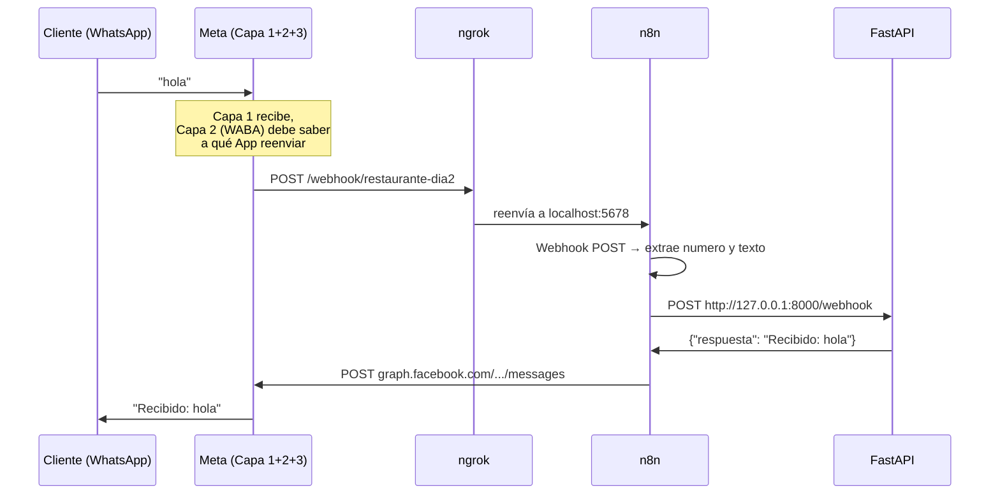

# Cómo funciona todo — Día 1 y Día 2 explicados en profundidad

> Este documento es para entender, con calma y de una vez, cómo se conecta cada pieza que armamos: FastAPI, ngrok, n8n y Meta. Está pensado para leerse completo, no como referencia rápida. Al final hay una versión resumida para el cliente, sin tecnicismos.

---

## 1. El panorama completo, de un vistazo

Antes de entrar en cada pieza, esta es la foto completa de cómo viaja un mensaje de WhatsApp desde el celular de un cliente hasta la respuesta que recibe de vuelta:



Cinco sistemas distintos, cada uno con un trabajo puntual. Ninguno sabe nada del funcionamiento interno de los demás — solo se pasan datos por HTTP (el protocolo estándar con el que hablan casi todos los programas en internet). Vamos uno por uno.

---

## 2. FastAPI — tu servidor propio

### Qué problema resuelve

Necesitás un programa que esté **siempre escuchando**, listo para recibir un mensaje en cualquier momento y contestar. Eso es un **servidor**: un proceso que corre sin parar, esperando peticiones.

FastAPI es la herramienta de Python que usamos para construir ese servidor. Por dentro combina dos piezas:
- **Starlette**: maneja el "cómo llega la petición" (la parte de networking puro — recibir un HTTP request, mandar una respuesta).
- **Pydantic**: valida que los datos que llegan tengan la forma correcta, automáticamente.

### El código exacto que armamos (Día 1)

`app/models.py`:
```python
from pydantic import BaseModel

class MensajeEntrante(BaseModel):
    numero: str
    texto: str
```

Esto define una "forma" de dato — cualquier mensaje que llegue tiene que tener un campo `numero` (texto) y un campo `texto` (texto). Si falta alguno, o viene con el tipo equivocado, FastAPI lo rechaza automáticamente **antes** de que tu código lo procese.

`app/main.py`:
```python
from fastapi import FastAPI
from app.models import MensajeEntrante

app = FastAPI()

@app.post("/webhook")
async def recibir_mensaje(mensaje: MensajeEntrante):
    return {"respuesta": f"Recibido: {mensaje.texto}"}
```

- `app = FastAPI()`: crea la aplicación — el objeto central al que se le cuelgan todas las rutas (URLs que el servidor sabe responder).
- `@app.post("/webhook")`: registra que, cuando llegue una petición **POST** (una petición que "manda datos", a diferencia de GET que "pide datos") a la URL `/webhook`, se ejecute la función de abajo.
- `async def`: permite que el servidor atienda otro mensaje mientras espera algo lento (como una llamada a Claude, que vendrá el Día 3) — no se queda bloqueado.
- El `return`: por ahora, un eco simple. Este es el lugar exacto donde más adelante va a ir la lógica real (reserva o respuesta de FAQ).

### Cómo se lo pone en marcha

```powershell
uvicorn app.main:app --reload
```

**Uvicorn** es un programa aparte de FastAPI — FastAPI define *qué* hace tu código, Uvicorn es quien realmente lo "enciende" y lo pone a escuchar en un puerto de tu máquina (el **8000**, en nuestro caso). `--reload` hace que se reinicie solo cada vez que guardás un cambio.

### Dónde vive

`http://127.0.0.1:8000` (o `http://localhost:8000` — son equivalentes en teoría, aunque anoche esa equivalencia nos rompió un nodo de n8n, más sobre esto en la sección de n8n). Esta dirección **solo existe dentro de tu propia computadora** — nada de afuera de tu PC puede llegar a `127.0.0.1`, ni siquiera tu celular en la misma wifi. Ahí es donde entra ngrok.

---

## 3. ngrok — el túnel hacia internet

### Qué problema resuelve

Tu FastAPI corre en `127.0.0.1:8000`, una dirección privada de tu máquina. Meta necesita mandarte mensajes desde **sus** servidores, en algún lugar de internet — y no tiene ninguna forma de llegar a una dirección que solo existe dentro de tu compu.

ngrok resuelve esto abriendo un **túnel**: le decís "exponé lo que está corriendo en el puerto tal", y te da una URL pública (algo como `https://create-dork-petroleum.ngrok-free.dev`) que reenvía automáticamente cualquier pedido que le llegue, directo hacia ese puerto de tu máquina.

### Un detalle importante que usamos anoche

En nuestro proyecto, ngrok **no apunta a FastAPI (8000)** — apunta a **n8n (5678)**:

```powershell
ngrok http 5678
```

¿Por qué? Porque quien tiene que ser visible desde afuera es n8n (es el que recibe el webhook de Meta). n8n, después, le habla a FastAPI **internamente**, dentro de la misma máquina, por `127.0.0.1:8000` — ese salto no necesita ningún túnel, porque n8n y FastAPI están en la misma compu.

### El panel de ngrok (`http://127.0.0.1:4040`)

Es una página que corre localmente y te muestra, en vivo, **cada petición HTTP que pasó por el túnel** — quién la mandó, a qué hora, con qué respuesta. Lo usamos anoche como "cámara de seguridad": si algo no funcionaba, mirábamos ahí para confirmar si el pedido de Meta **llegó siquiera** hasta tu máquina, antes de sospechar de n8n o FastAPI.

### Una corrección sobre el plan gratuito (dato verificado el 6 ago)

Durante el Día 2 asumimos que ngrok asigna un dominio nuevo al azar en cada reinicio. **Es incorrecto.** Toda cuenta de ngrok, incluso gratuita, tiene un **dev domain fijo** asignado automáticamente a la cuenta (algo como `https://create-dork-petroleum.ngrok-free.dev`), que se reutiliza solo con `ngrok http <puerto>` — sin pasar `--domain` — y persiste mientras la cuenta exista. Lo confirmamos porque, tras reiniciar la máquina para el Día 4, `ngrok http 5678` levantó exactamente la misma URL que estaba configurada en Meta desde el Día 2 (verificado comparando el log de esa sesión, `ngrok.log`, contra el arranque de hoy).

En la práctica: **no hace falta reconfigurar el Callback URL en Meta en cada reinicio de ngrok**, salvo que se cierre sesión en la cuenta de ngrok o se libere/cambie el dev domain manualmente desde el dashboard.

---

## 4. n8n — el orquestador en el medio

### Qué problema resuelve

Podríamos, en teoría, hacer que Meta le hable directo a FastAPI. Pero n8n se pone en el medio por una razón concreta: te da un **registro visual** de cada mensaje que pasa (qué entró, qué salió de cada paso), y te permite agregar lógica nueva (como guardar en Google Sheets, el Día 4) sin tocar una línea de Python.

n8n funciona con **workflows**: una secuencia de **nodos** conectados con flechas, donde cada nodo hace una cosa puntual y le pasa el resultado al siguiente.

### El workflow que armamos: "Restaurante - Dia 2 - WhatsApp a FastAPI"



**Por qué son dos caminos separados (GET y POST):** un solo nodo Webhook de n8n solo puede escuchar **un** método HTTP a la vez. Meta usa GET para la verificación inicial (el "challenge") y POST para mandar mensajes reales — así que necesitamos dos nodos Webhook distintos, ambos en el mismo path, cada uno reaccionando a su método.

### Nodo por nodo

**Webhook GET (verificación Meta)**
Escucha en `https://[tu-dominio-ngrok]/webhook/restaurante-dia2`, solo peticiones GET. Cuando registrás el webhook en el panel de Meta, Meta manda una petición de prueba con tres parámetros: `hub.mode`, `hub.verify_token`, y `hub.challenge`. Este nodo la recibe y se la pasa al siguiente.

**Verificar token (nodo IF)**
Compara el `hub.verify_token` que mandó Meta contra un valor fijo que vos definiste (el *verify token*, que no se versiona). Es una contraseña simple, inventada por vos, que confirma que quien está registrando el webhook sos realmente vos (o alguien con acceso al panel de Meta), no un tercero cualquiera.

**Responder challenge**
Si el token coincide, este nodo devuelve el valor de `hub.challenge` tal cual — eso es lo que Meta espera recibir de vuelta para dar la verificación por buena. Sin esto, Meta nunca activa el webhook.

**Rechazar verificación**
Si el token NO coincide, devuelve un error 403. Lo agregamos nosotros mismos (no lo pedía la guía original) porque sin esto, una verificación fallida deja a Meta esperando una respuesta que nunca llega, hasta el timeout.

**Webhook POST (mensajes)**
El path real por donde entran los mensajes de WhatsApp de verdad, una vez que el webhook ya está verificado y activo.

**Llamar a FastAPI**
Toma el mensaje que mandó Meta (que viene en un formato bastante anidado, ver más abajo) y le hace un POST a tu servidor FastAPI local, con el `numero` y `texto` extraídos.

**Responder por WhatsApp**
Toma la respuesta que devolvió FastAPI (`{"respuesta": "Recibido: hola"}`) y la manda de vuelta al cliente real, llamando a la API de WhatsApp de Meta directamente (`https://graph.facebook.com/v21.0/{PHONE_NUMBER_ID}/messages`), con el token de autorización en el header.

### El formato real que manda Meta

Cuando llega un mensaje real, el body del POST no es simple — viene anidado así:

```json
{
  "object": "whatsapp_business_account",
  "entry": [{
    "id": "...",
    "changes": [{
      "field": "messages",
      "value": {
        "messages": [{
          "from": "5492625634845",
          "text": { "body": "hola" }
        }]
      }
    }]
  }]
}
```

Por eso los nodos "Llamar a FastAPI" y "Responder por WhatsApp" tienen que "bucear" dentro de esa estructura (`$json.body.entry[0].changes[0].value.messages[0]`) para sacar el número y el texto reales — no es un capricho, es la forma en la que Meta empaqueta la información.

### Publicar vs. guardar (el detalle que nos complicó anoche)

n8n separa **guardar un cambio** (automático, mientras editás) de **publicarlo** (un botón explícito, "Publish"). Mientras no apretás Publish, la URL de producción sigue respondiendo con la versión **anterior** del workflow — no la que ves en pantalla. Esto nos generó confusión varias veces anoche: editábamos un nodo, pero el cambio no llegaba a producción hasta publicar de nuevo.

---

## 5. Meta / WhatsApp Cloud API — las tres capas

Esta es la parte que más nos costó entender anoche, así que vale la pena el detalle completo.

### La idea errónea que teníamos

Pensábamos que la cadena era simplemente: **Meta → tu webhook**. Configurás una URL, Meta te manda cosas ahí, listo.

### La realidad: son tres piezas separadas



- **Capa 1 — Número de teléfono**: el número de prueba que te dio Meta. Ahí llega físicamente el mensaje del cliente.
- **Capa 2 — WABA (WhatsApp Business Account)**: es el "contenedor" administrativo que agrupa uno o más números de teléfono. Tiene su propio ID (`2468202600345069` en nuestro caso).
- **Capa 3 — App de Meta**: la aplicación que registraste en developers.facebook.com (`Accelerate Restaurant Bot`), donde configuramos la URL de callback y el verify token.

**El problema real de anoche**: configuramos perfecto la Capa 3 (URL, token, campo `messages` suscrito — todo eso lo confirmamos con el check verde, una y otra vez). Pero **nunca conectamos la Capa 2 con la Capa 3**. Ese link — "el WABA está autorizado a mandarle mensajes a esta App" — se crea con una llamada a la API aparte, y **no aparece en ningún botón del panel visual que usamos**.

### Por qué el botón de "test" de Meta nos engañó

El botón "Enviar a mi servidor" que probamos mil veces anoche **manda el payload directo a tu URL, sin pasar por el WABA**. Por eso siempre funcionó. Un mensaje real, en cambio, tiene que atravesar las tres capas — y como la Capa 2 no sabía a quién reenviarle nada, el mensaje se perdía ahí, sin ningún error visible en ningún lado. Coincide exacto con lo que vivimos: nada en el panel de ngrok, nada en n8n, silencio total.

### El arreglo (para hacer esta tarde)

Con una API key con permisos de `whatsapp_business_management`, se hacen dos llamadas:

```
GET https://graph.facebook.com/v21.0/2468202600345069/subscribed_apps
```
(chequea si hay alguna App vinculada — si devuelve `"data": []`, confirma el diagnóstico)

```
POST https://graph.facebook.com/v21.0/2468202600345069/subscribed_apps
```
(crea el link entre el WABA y la App actual)

No hace falta recrear nada — es un paso puntual, una sola vez, sobre la app que ya tenemos.

---

## 6. Las claves y tokens — quién usa cuál

| Nombre | Dónde se genera | Para qué sirve | Dónde se usa |
|---|---|---|---|
| `WHATSAPP_TOKEN` | Panel de Meta, "Identificador de acceso" (dura ~24hs o menos) | Autoriza llamadas a la API de WhatsApp (mandar mensajes) | Header `Authorization: Bearer ...` del nodo "Responder por WhatsApp" en n8n, y en `.env` |
| `WHATSAPP_PHONE_ID` | Panel de Meta, se ve fijo en el número de prueba | Identifica DESDE qué número se manda un mensaje | URL del nodo "Responder por WhatsApp" (`.../{PHONE_ID}/messages`) |
| Verify Token | Inventado por vos | Confirma que quien registra el webhook sos vos, no un tercero | Nodo "Verificar token" en n8n, y campo "Identificador de verificación" en Meta |
| `N8N_API_KEY` | Panel de n8n, Settings → API | Permite que scripts externos (o Claude Code) creen/actualicen workflows sin usar la interfaz web | Usado en los scripts de PowerShell que corrimos para actualizar el workflow |
| WABA ID (`2468202600345069`) | Fijo, se ve en el panel de Meta | Identifica la cuenta de WhatsApp Business | Usado para el link Capa 2 ↔ Capa 3 (`subscribed_apps`) |

**Ninguna de estas claves viaja "de un lado a otro" en el sentido de que un sistema se la pase a otro por la red en texto plano** — cada una vive guardada en el lugar que la necesita (el `.env` de tu proyecto, o dentro de la configuración de cada nodo de n8n), y se usa ahí mismo para autenticar esa llamada puntual.

---

## 7. El viaje completo de un mensaje, en una sola secuencia



---

## 8. Glosario rápido

- **API**: la forma estándar en que dos programas se pasan información por internet.
- **Webhook**: un endpoint pensado para que OTRO sistema (en este caso, Meta) te avise cuando pasa algo, en vez de que vos le preguntes todo el tiempo.
- **Endpoint**: una URL puntual que responde a un tipo de pedido concreto (ej. `/webhook`).
- **Token / API key**: una clave secreta que identifica quién está haciendo un pedido — nunca se comparte ni se sube a git.
- **Túnel**: una forma de hacer que algo que corre en tu máquina privada sea accesible desde internet.

---

## 9. Para el cliente — resumen sin tecnicismos

Anoche conectamos el bot a un número de WhatsApp real de prueba. El camino que recorre un mensaje es: tu WhatsApp → los servidores de Meta (la empresa dueña de WhatsApp) → una herramienta llamada n8n que actúa de intermediario → nuestro programa en Python (FastAPI) → y la respuesta vuelve por el mismo camino.

Armamos y probamos cada parte de ese camino por separado, y confirmamos que todas funcionan bien — con una herramienta de prueba que ofrece Meta, todo respondió perfecto. Lo único que faltó fue un paso administrativo dentro de Meta: decirle a la cuenta de WhatsApp "los mensajes reales que lleguen, mandaselos a nuestra aplicación" — un paso que no está en ningún botón visible del panel, y que recién hoy a la tarde vamos a completar con un comando puntual.

No es que algo esté roto — es un trámite de configuración de Meta que faltó, no un problema del código ni de cómo armamos el bot.
